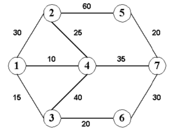

Mr. X works as a tourist guide. Currently, his task is to transport a certain number of tourists between the two cities with one of the existing two-way roads. Between each pair of neighboring cities there is a bus line that connects them and only them. Each of these lines has buses that can only take a certain number of people per day. Mr. X has a map of the cities and roads between them and information about the limit of each line.
He also knows that he will not always be able to transport all tourists on one course. Our goal is to minimize the number of courses. Let's consider the following case:
 

Suppose we want to transport 99 tourists from city 1 to city 7. The correct solution is to carry out the route 1, 2, 4, 7, where 5 trips needed. Please
write a program that will indicate the minimum number of courses.

Input:
A single input file contains one test data. The first line of the file contains two integer numbers `m`, `d` (m < 100), where `m` is the number of cities and `d` is the number of roads. The next `d` lines contain three integers each: `c`1 , `c`2 , `p`, (1 < p < 1000000), where c1 and `c`2 are city numbers and `p` is the maximum number of passengers that can be transported between them on a single trip. The following lines contain three integers `s`, `e` , `t`, ( 1 < t < 1000000), where `s` and `e` are the beginning and end of the route, and `t` - the number of passengers to be transported between them. The end of valid data is marked by a line containing two zeros.

Output:
The output file should contain as many lines as there are test cases. Each line should contain one integer corresponding to the number of courses that should be completed for the next test case.

Example:

| Input: | Output|
|---|---|
|7 10| 5|
|1 2| 30|
|1 3| 15|
|1 4| 10|
|2 4| 25|
|2 5| 60|
|3 4| 40|
|3 6| 20|
|4 7| 35|
|5 7| 20|
|6 7 30||
|1 7 99||
|0 0||

